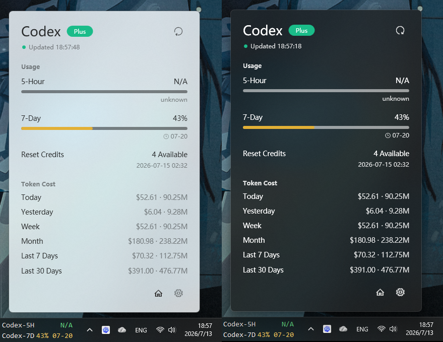

# CodexTray

## 目录

- [概览](#概览)
- [效果展示](#效果展示)
- [功能](#功能)
- [安装](#安装)
- [使用](#使用)
- [插件支持](#插件支持)
- [数据与隐私](#数据与隐私)
- [常见问题](#常见问题)

## 概览

`CodexTray` 是一个适用于 Windows x64 的托盘应用. 它读取当前 Windows 用户的 Codex 登录信息, 从 ChatGPT 官方接口获取 5-Hour 和 7-Day 额度, 并通过本地服务把额度提供给 LiteMonitor 与 TrafficMonitor 插件.

应用还会统计本机 Codex 会话的 token 用量, 按模型价格估算 API 等价成本. 所有信息都集中显示在托盘弹窗中, 无需持续打开主窗口.

## 效果展示

## 功能

- 显示 Codex 计划状态, 5-Hour 与 7-Day 剩余额度和重置时间.
- 显示可用 Reset Credits 数量及最近到期时间.
- 统计 Today, Yesterday, Week, Month, Last 7 Days 和 Last 30 Days 的 token 用量与 API 等价成本.
- 支持选择 Token Cost 项目和中英文 token 数量单位.
- 默认每 1 分钟自动刷新, 支持 1 到 1440 分钟的自定义间隔和手动刷新.
- 支持 `System`, `Light`, `Dark` 主题, Acrylic blur 和透明度设置.
- 自动检测 LiteMonitor 与 TrafficMonitor 安装目录, 并一键安装对应插件.
- 支持插件中显示或隐藏额度重置时间, 以及倒计时或绝对时间格式.
- 支持随 Windows 启动, 自定义本地 HTTP 端口和单实例运行.

## 安装

1. 从 [GitHub Releases](https://github.com/SnowyLake/CodexTray/releases) 下载 `CodexTray-vX.Y.Z-win-x64.zip`.
2. 解压完整目录, 不要只复制 `CodexTray.exe`.
3. 确认系统已安装 [.NET 9 Desktop Runtime](https://dotnet.microsoft.com/download/dotnet/9.0).
4. 运行 `CodexTray.exe`.

发布包中的 `Resources` 保存图标和模型价格, `Plugins` 保存 LiteMonitor 与 TrafficMonitor 插件文件. 缺少这些目录时, 部分界面或插件安装功能将不可用.

## 使用

首次启动时, 应用会保存默认设置并打开主面板. 之后应用常驻 Windows 系统托盘.

- 左键单击托盘图标: 打开或隐藏主面板.
- 右键单击托盘图标: 使用 `Open Panel`, `Refresh Now` 或 `Exit`.
- Home 页: 查看额度, Reset Credits, Token Cost 和最近更新时间.
- Settings 页: 调整刷新, 显示, 自启动, 插件目录和 HTTP 端口设置.

再次运行 `CodexTray.exe` 不会启动第二个实例, 而是通知已有实例打开主面板.

## 插件支持

CodexTray 支持 LiteMonitor 与 TrafficMonitor. 在 Settings 页找到对应监控器, 使用 `Browse` 手动选择目录或 `Auto detect` 自动定位, 然后点击 `Setup` 安装插件. 安装完成后重启对应监控器或重新加载插件.

LiteMonitor 显示 `Codex 5-Hour` 和 `Codex 7-Day` 两项, 从 JSON 接口读取数据. TrafficMonitor 原生插件显示同样两项, 从两行文本接口读取数据. 插件默认保留宿主自己的 label 和布局.

如果修改了 CodexTray 的 HTTP 端口, 请重新执行 `Setup`, 让插件配置同步到新端口.

## 数据与隐私

- 额度和 Reset Credits 来自 ChatGPT 官方接口. 应用读取 `~/.codex/auth.json` 中的 Codex OAuth 凭据.
- Token Cost 来自本机 `~/.codex/sessions` 与 `~/.codex/archived_sessions` 日志, 并使用发布包中的 `Resources/model-pricing.json` 计算 API 等价成本.
- 本地 HTTP 服务默认仅监听 `127.0.0.1:17890`, 不向局域网开放.
- OAuth token 不会写入日志, 插件配置或本地 HTTP 响应.
- 应用设置保存在 `CodexTray.exe` 同级目录的 `settings.json`.

## 常见问题

### 为什么额度显示 N/A

请确认当前 Windows 用户已登录 Codex, `~/.codex/auth.json` 存在且凭据有效, 并且网络可以访问 ChatGPT.

### 为什么 Token Cost 显示 N/A

请确认发布目录包含 `Resources/model-pricing.json`, 并且当前用户存在 Codex session 日志. 未收录价格的模型可以统计 token, 但无法计算成本.

### 为什么 LiteMonitor 或 TrafficMonitor 没有更新

请确认 CodexTray 正在运行, 在托盘菜单中点击 `Refresh Now`, 再检查监控器路径并重新执行 `Setup`. 如果修改过 HTTP 端口, 必须重新安装插件配置.

### 为什么找不到 LiteMonitor 或 TrafficMonitor

自动检测会搜索本机磁盘中的 `LiteMonitor.exe` 或 `TrafficMonitor.exe`. 也可以使用 `Browse` 直接选择包含对应可执行文件的目录.

### 为什么托盘图标没有直接显示在任务栏

Windows 负责管理托盘图标的可见区域. 请在系统托盘展开区或 Windows 的任务栏设置中调整 CodexTray 的显示状态.
