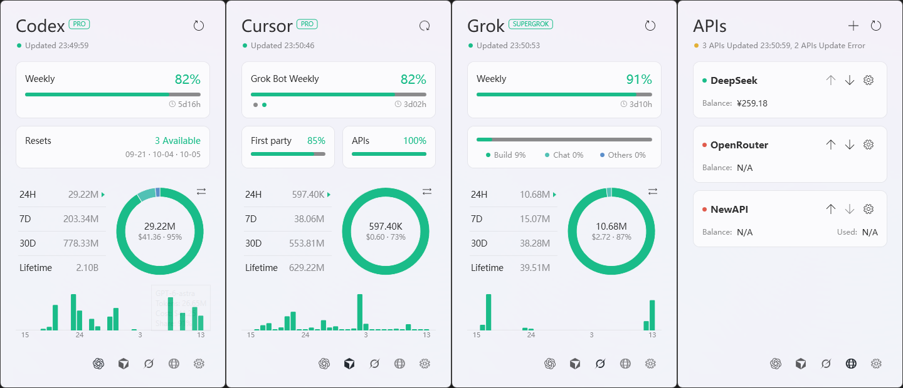

# CodexTray

## 目录

- [概览](#概览)
- [效果展示](#效果展示)
- [功能](#功能)
- [安装](#安装)
- [使用](#使用)
- [Cursor 页面](#cursor-页面)
- [API 监控](#api-监控)
- [插件支持](#插件支持)
- [数据与隐私](#数据与隐私)
- [常见问题](#常见问题)

## 概览

`CodexTray` 是一个适用于 Windows x64 的托盘应用. 它读取当前 Windows 用户的 Codex 登录信息, 从 ChatGPT 官方接口获取 5-Hour 和 7-Day 额度, 并通过本地服务把额度提供给 LiteMonitor 与 TrafficMonitor 插件.

应用还会统计本机 Codex 会话的 token 用量, 按模型价格估算 API 等价成本. 所有信息都集中显示在托盘弹窗中, 无需持续打开主窗口.

除了 Codex 额度, 应用还可以在独立的 Cursor 页面查看 Cursor 额度与 token 账单统计, 并在 APIs 页面监控 DeepSeek, NewAPI 和 Grok 的余额或用量.

## 效果展示

## 功能

- 显示 Codex 计划状态, 5-Hour 与 7-Day 剩余额度和重置时间.
- 显示可用 Reset Credits 数量及最近到期时间.
- 统计 Today, Yesterday, This week, This month, Last 7 days, Last 30 days 和 Lifetime 的 token 用量与 API 等价成本.
- 支持选择 Token Cost 项目和中英文 token 数量单位.
- Cursor 页面显示 Total, First Party 和 APIs 剩余额度, Total 重置时间, 以及 7 个周期的实际账单 token 与成本.
- 支持 DeepSeek CNY 余额, NewAPI 剩余与已用额度, 以及 Grok 剩余额度和重置时间监控.
- 支持添加, 命名, 排序和删除多个 API 监控卡片, 并显示单项与汇总刷新状态.
- 默认每 1 分钟自动刷新, 支持 1 到 1440 分钟的自定义间隔和手动刷新.
- 支持 `System`, `Light`, `Dark` 主题, Windows 11 22H2+ native Acrylic blur, Windows 10 solid background 和窗口尺寸设置.
- 支持隐藏 Codex, Cursor 或 APIs 页面并停止对应后台采集, 以及隐藏没有有效额度窗口的 Codex 进度条.
- 自动检测 LiteMonitor 与 TrafficMonitor 安装目录, 并一键安装对应插件.
- 支持插件中显示或隐藏额度重置时间, 以及倒计时或绝对时间格式.
- 支持随 Windows 启动, 自定义本地 HTTP 端口和单实例运行.

## 安装

1. 从 [GitHub Releases](https://github.com/SnowyLake/CodexTray/releases) 下载 `CodexTray-vX.Y.Z-win-x64.zip`.
2. 解压完整目录, 不要只复制 `CodexTray.exe`.
3. 确认系统已安装 [.NET 9 Desktop Runtime](https://dotnet.microsoft.com/download/dotnet/9.0).
4. 运行 `CodexTray.exe`.

发布包中的 `Resources` 保存图标和模型价格, `Plugins` 保存 LiteMonitor 与 TrafficMonitor 插件文件. 缺少这些目录时, 部分界面或插件安装功能将不可用.

## 使用

首次启动时, 应用会保存默认设置并打开主面板. 之后应用常驻 Windows 系统托盘.

- 左键单击托盘图标: 打开或隐藏主面板.
- 右键单击托盘图标: 使用 `Open Panel`, `Refresh Now` 或 `Exit`.
- Codex 页: 查看额度, Reset Credits, Token Cost 和最近更新时间.
- Cursor 页: 查看 Total, First Party, APIs 额度和实际账单 Token Cost.
- APIs 页: 添加和查看 DeepSeek, NewAPI 或 Grok 监控卡片.
- Settings 页: 调整可见页面, 刷新, 显示, 窗口尺寸, 自启动, 插件目录和 HTTP 端口设置. `Visible pages` 可分别隐藏 Codex, Cursor 和 APIs 入口并停止对应后台采集, 隐藏 Codex 时还会停止本地 HTTP 服务.
- About 页: 查看当前版本, 项目主页和许可证信息.

再次运行 `CodexTray.exe` 不会启动第二个实例, 而是通知已有实例打开主面板.

## Cursor 页面

Cursor 页面直接读取本机 Cursor IDE 已保存的 OAuth session (`state.vscdb`). 页面会请求 Cursor 官方 usage-summary 和 usage-events 接口. 两个请求共享一次本地凭据读取和最多一次 OAuth refresh 重试. Total, First Party 和 APIs 显示独立剩余额度, 只有 Total 显示重置时间. Token Cost 的 Today, Yesterday, This week, This month, Last 7 days, Last 30 days 和 Lifetime 与 Codex 页使用相同的可见性和 token 单位设置.

Cursor Token Cost 使用 Cursor usage events 返回的实际 `totalCents`, 不会用本地模型价格表重算. OAuth token 不会写入 `settings.json`.

## API 监控

在 APIs 页点击右上角的添加按钮, 选择 provider 并填写对应信息, 再点击卡片右上角的保存按钮. API 监控会按刷新间隔自动更新, 也可以手动刷新. 隐藏 APIs 页后会停止 API 监控采集.

- DeepSeek: 填写 Base URL 和 API key, 默认 Base URL 为 `https://api.deepseek.com`.
- NewAPI: 填写实例 Base URL, access token 和 User ID.
- Grok: 选择 `Grok Build` 或 `OpenCode` OAuth source. CodexTray 直接读取所选工具已保存的本地 OAuth session, 不要求复制 token. access token 临近过期时会自动刷新并写回对应 auth 文件.

卡片支持自定义显示名称, 调整顺序和删除. Grok 的重置时间遵循 Settings 页中的倒计时或绝对时间格式设置. Cursor 已使用独立页面, 不再作为 API 监控卡片.

## 插件支持

CodexTray 支持 LiteMonitor 与 TrafficMonitor. 在 Settings 页找到对应监控器, 使用 `Browse` 手动选择目录或 `Auto detect` 自动定位, 然后点击 `Setup` 安装插件. 安装完成后重启对应监控器或重新加载插件.

LiteMonitor 显示 `Codex 5-Hour` 和 `Codex 7-Day` 两项, 从 JSON 接口读取数据. TrafficMonitor 原生插件显示同样两项, 从两行文本接口读取数据. 插件默认保留宿主自己的 label 和布局.

如果修改了 CodexTray 的 HTTP 端口, 请重新执行 `Setup`, 让插件配置同步到新端口.

## 数据与隐私

- 额度和 Reset Credits 来自 ChatGPT 官方接口. 应用读取 `~/.codex/auth.json` 中的 Codex OAuth 凭据.
- Token Cost 来自本机 Codex session 日志与 OpenCode `opencode.db` 中的 OpenAI 调用, 并使用发布包中的 `Resources/model-pricing.json` 计算 API 等价成本.
- DeepSeek 与 NewAPI 请求直接发送到卡片中配置的 Base URL. API key, access token 和 User ID 以明文保存在 `CodexTray.exe` 同级目录的 `settings.json` 中.
- Grok 监控读取 Grok Build 或 OpenCode 已保存的本地 OAuth session, 并向 Grok 官方接口查询用量. access token 过期前会通过 xAI OAuth refresh 自动续期并写回原 auth 文件. OAuth token 不会复制到 `settings.json`.
- Cursor 页面读取本机 Cursor IDE 的 `state.vscdb` OAuth session, 并向 Cursor 官方 usage-summary 与 usage-events 接口查询额度和账单用量. access token 过期前会通过 Cursor OAuth refresh 自动续期并写回原数据库. OAuth token 不会复制到 `settings.json`.
- 本地 HTTP 服务默认仅监听 `127.0.0.1:17890`, 不向局域网开放.
- OAuth token 不会写入日志, 插件配置或本地 HTTP 响应.
- 应用设置保存在 `CodexTray.exe` 同级目录的 `settings.json`.

## 常见问题

### 为什么额度显示 N/A

请确认当前 Windows 用户已登录 Codex, `~/.codex/auth.json` 存在且凭据有效, 并且网络可以访问 ChatGPT.

### 为什么 Token Cost 显示 N/A

请确认发布目录包含 `Resources/model-pricing.json`, 并且当前用户存在 Codex session 日志或 OpenCode OpenAI 调用记录. 未收录价格的模型可以统计 token, 但无法计算成本.

### 为什么 API 卡片显示 N/A

将鼠标悬停在卡片名称或状态圆点上查看错误信息. DeepSeek 和 NewAPI 需要有效的 Base URL 与凭据, NewAPI 还需要 User ID. Grok 需要先在所选的 Grok Build 或 OpenCode 中完成 xAI OAuth 登录. CodexTray 会自动刷新 Grok access token; 若 refresh token 也失效, 请回到对应工具重新登录.

### 为什么 Cursor 页面显示 N/A

请确认本机 Cursor IDE 已登录. CodexTray 会自动刷新 Cursor access token; 若 refresh token 也失效, 请回到 Cursor IDE 重新登录. 额度与 Token Cost 分别来自两个接口, 因此其中一部分失败时另一部分仍可能正常显示.

### 为什么 LiteMonitor 或 TrafficMonitor 没有更新

请确认 CodexTray 正在运行且 Settings 中 Codex 页面可见, 在托盘菜单中点击 `Refresh Now`, 再检查监控器路径并重新执行 `Setup`. 如果修改过 HTTP 端口, 必须重新安装插件配置.

### 为什么找不到 LiteMonitor 或 TrafficMonitor

自动检测会搜索本机磁盘中的 `LiteMonitor.exe` 或 `TrafficMonitor.exe`. 也可以使用 `Browse` 直接选择包含对应可执行文件的目录.

### 为什么托盘图标没有直接显示在任务栏

Windows 负责管理托盘图标的可见区域. 请在系统托盘展开区或 Windows 的任务栏设置中调整 CodexTray 的显示状态.
